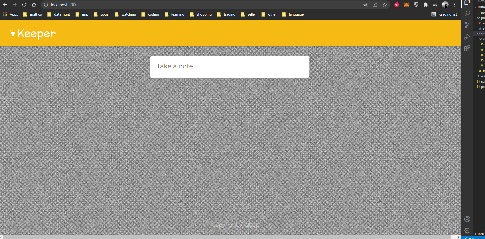
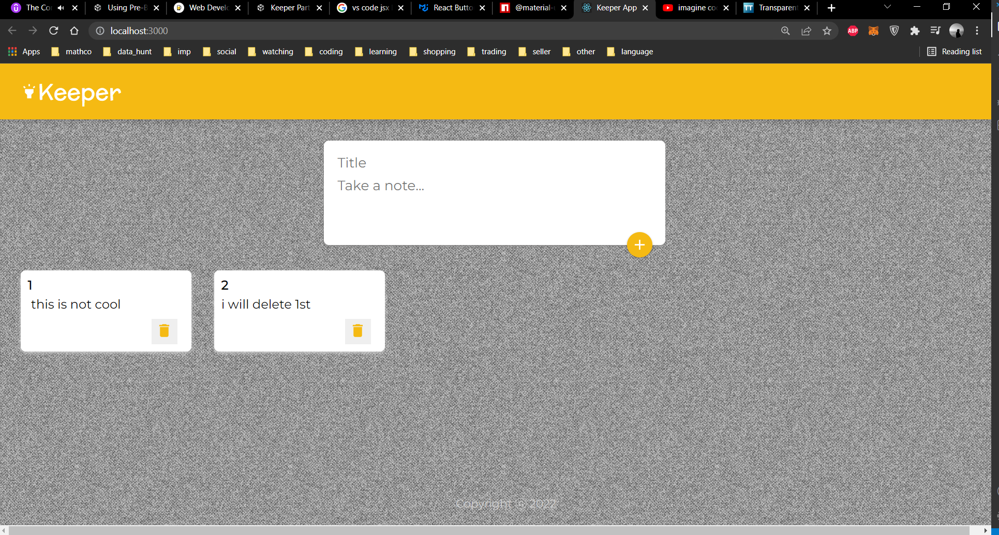
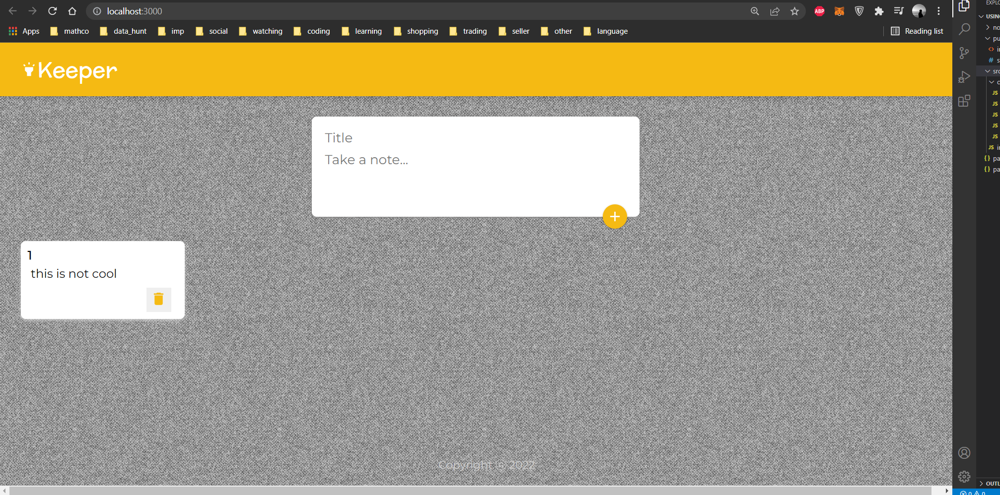
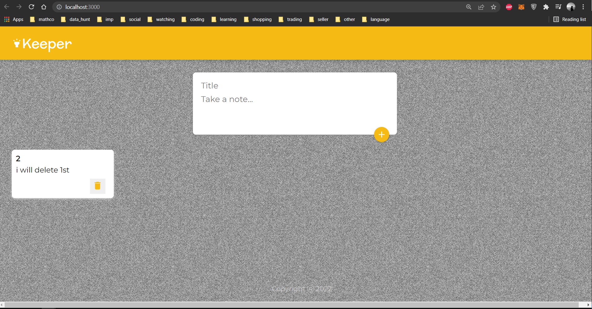

# Keepe_3

Download repo and then follow steps
1. go to console terminal of vscode and run npm install
2. npm start to start the server

- <h1>Landing page</h1>

- <h1>expanded</h1>

- <h1>adding</h1>

- <h1>deleting</h1>

